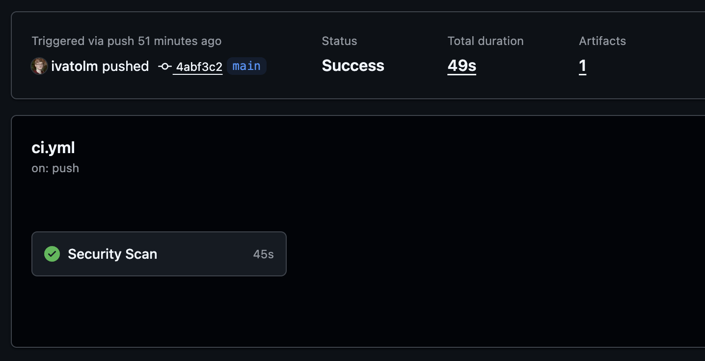

# Лабораторная работа 1: Разработка защищенного REST API с интеграцией CI/CD

# Описание API

В API есть всего 3 endpoint-а:
1. register
2. login
3. data

## Endpoint /auth/register
Принимает JSON:
```json
{
    "username": "my_username_123",
    "password": "best_password"
}
```
При успешном выполнении возвращает JSON:
```json
{
    "message": "User created"
}
```
При не успешном выполнении возвращает JSON:
```json
{
    "error": "<error message>"
}
```

## Endpoint /auth/login
Принимает JSON:
```json
{
    "username": "my_username_123",
    "password": "best_password"
}
```
При успешном выполнении возвращает JSON:
```json
{
    "token": "<JWT>"
}
```
При не успешном выполнении возвращает JSON как `/auth/register`.

## Endpoint /api/data
Принимает Authorization header с JWT токеном.

Возвращает JSON:
```json
{
    "users": {
        "id": 1,
        "username": "my_username_123"
    }
}
```

# Меры защиты
Для защиты от SQLi все запросы к базе данных были реализованны при помощи prepared statements, например:
```python
user = conn.execute(
    "SELECT * FROM users WHERE username = ?", (username,)
).fetchone()
```

Для защиты от XSS была реализована экранизация пользовательского ввода. Таким образом, каждый
раз когда данные отдаются клиенту они уже экранированны, поскольку они уже хранятся в безопасном виде.

Аутентификация реализована при помощи JWT токена, сам токен хэшируется при помощи SHA-256.
После регистрации пользователь отправляет запрос на `/auth/login` и ему выдают временный токен.
Дальше, на все защищенные endpoint-ы он отправляет этот токен в поле Autherization (в header-е запроса).

# Скриншоты SAST/SCA

Замечу, что есть warning. Он был поправлен, но скриншот я приложил этот, как просилось в чате.



